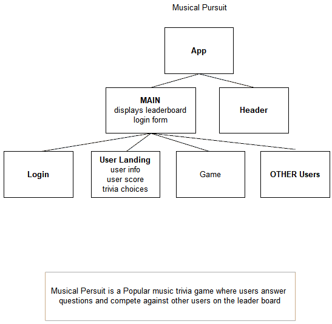
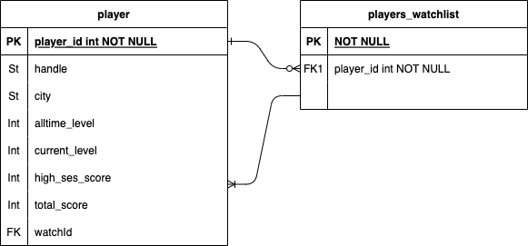

# musicial_pursuit_front

RockDog Trivia is a music trivia app where Users can compete against other users in answering trivia questions about popular music of ver last 70 years.

Utilizing AudioDb API (https://www.theaudiodb.com/) to serve data about songs and artists, users will answer questions in rounds of 3.  Each correct answer wins you points, each missed answer LOSES you points.  3 correct answers wins you a level up!

A user can search other users and add other to their "watchlist" to watch their competition!  User can also send barks to their comepetitors(which are basically comments or tweets) as a way to foster healthy competition.

**Trello https://trello.com/b/Nsv0lIuI/capstone-project 
**Front End Repo https://github.com/jscarpelli3/musical_pursuit_server 
**Back End Repo https://github.com/jscarpelli3/musicial_pursuit_front 

Credits (Inspiration, Resources Advice):

**API serving data for the game(including artist logos):  https://www.theaudiodb.com/

<a href="https://www.flaticon.com/free-icons/dog" title="dog icons">Icons created by Freepik - Flaticon</a>

<a href="https://medium.com/@ronnow/dropdowns-in-vue-the-right-way-8ff9e8f36d4a">Code Inspiration for Navigation Drop Down</a>

<a href="https://blog.boot.dev/javascript/how-to-create-a-custom-checkbox-form-in-vue/">Reference for radio button functionality</a>

<a href="https://dev.to/proticm/styling-html-checkboxes-is-super-easy-302o">Reference for radio button functionality</a>

<a href="https://codeburst.io/how-to-create-horizontal-scrolling-containers-d8069651e9c6">CSS Style titps for side scrolling</a>